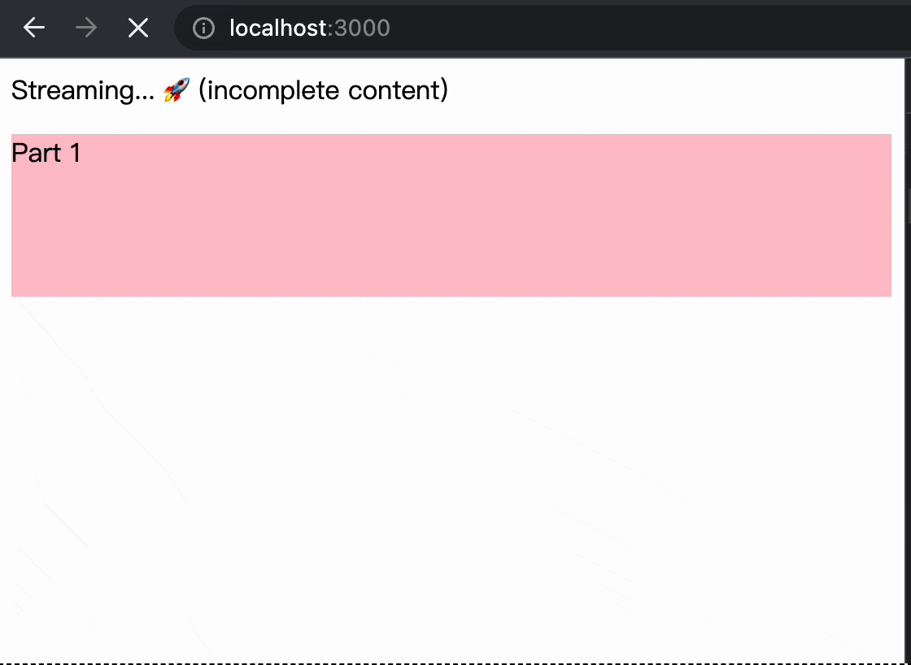

# demo-html-stream
Demo for how html stream works.

> Browser renders incomplete html content by automatically close tags when streaming,
> and rerenders when received rest content.

<p align="center">
  
</p>

## Usage

Clone this repo to local, then run:

```bash
pnpm i

npm run start
```
